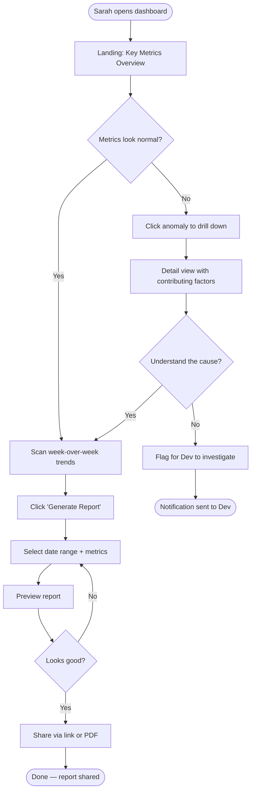

# Design Strategy: SaaS Analytics Dashboard

*Full worked example showing all 5 phases*

---

## Phase 1: Discovery

### User Personas

#### Persona: Sarah — Marketing Manager

**Role:** Marketing Manager at a 50-person B2B SaaS company
**Tech comfort:** Medium

**Goals**
- See campaign ROI at a glance without asking the data team
- Report performance to leadership weekly

**Frustrations**
- Current analytics tool requires SQL knowledge she doesn't have
- Takes 30+ minutes to build a report that should take 5
- Numbers in different tools never match

**Context**
- Uses the dashboard 3-5x per week, mostly Monday mornings
- Currently exports CSVs and builds charts in Google Sheets
- Needs to share reports with her VP

**Quote**
> "I just want to see what's working and what's not without becoming a data analyst."

**Assumptions** ⚠️
- Assumes she has a basic understanding of marketing metrics (CAC, LTV, conversion rates)
- Assumes she prefers visual charts over data tables

---

#### Persona: Dev — Data Engineer

**Role:** Data Engineer responsible for pipeline and data quality
**Tech comfort:** High

**Goals**
- Monitor data freshness and pipeline health
- Debug data discrepancies quickly when Sarah reports "the numbers look wrong"

**Frustrations**
- Gets interrupted to pull ad-hoc reports
- No visibility into which dashboards are broken or stale
- Alert fatigue from noisy monitoring

**Context**
- Checks the dashboard daily, but rarely builds reports in it
- Cares about the data layer, not the visualization layer
- Wants self-serve analytics so people stop asking him for data

**Quote**
> "If the dashboard showed data freshness timestamps, I'd get 50% fewer Slack messages."

---

### Jobs-to-Be-Done

```
When I open my laptop on Monday morning,
I want to see last week's key metrics compared to the previous week,
so I can identify what needs attention before standup.
```

```
When my VP asks "how did the Q3 campaign perform?",
I want to generate a shareable report in under 2 minutes,
so I can respond before the conversation moves on.
```

```
When a dashboard shows unexpected numbers,
I want to check data freshness and pipeline status,
so I can determine if it's a data issue or a real trend.
```

### Competitive Analysis

| Aspect | Our Dashboard | Mixpanel | Amplitude | Metabase |
|--------|--------------|----------|-----------|----------|
| Core value prop | Simple metrics for non-technical teams | Product analytics | Behavioral analytics | Open-source BI |
| Primary audience | Marketing/sales managers | Product managers | Product teams | Data-savvy teams |
| Onboarding time | ? (target: < 10 min) | 30-60 min | 30-60 min | 2-4 hours |
| SQL required | No | No | No | Yes, for custom |
| Sharing | ? | Link + embed | Link + embed | Link + embed |
| Biggest weakness | Not built yet | Expensive, complex | Steep learning curve | Requires SQL for anything custom |

**Opportunity:** No tool does "simple weekly reports for non-technical managers" well. They all target power users and product teams.

---

## Phase 2: Definition

### Primary User Flow: Weekly Report



### Journey Map: Monday Morning Check-in (Sarah)

| Stage | Actions | Thinking | Feeling | Pain Points | Opportunities |
|-------|---------|----------|---------|-------------|---------------|
| Open dashboard | Navigates to app, logs in | "Let me see how last week went" | Neutral | If login is slow, momentum breaks | Auto-login, fast first paint |
| Scan overview | Reads key metric cards | "Are we up or down?" | Curious | Too many numbers = overwhelm | Highlight only significant changes |
| Spot anomaly | Notices conversion rate dropped | "Why did this drop?" | Concerned | No explanation visible | Show contributing factors inline |
| Drill down | Clicks into conversion detail | "Was it the landing page or the ad?" | Focused | Detail view is a separate page load | Inline expansion, no page nav |
| Generate report | Clicks report button | "VP asked for this yesterday" | Slightly stressed | Report builder is too flexible | Smart defaults based on past reports |
| Share | Copies link, pastes in Slack | "Hope the link works for her" | Relieved | Shared links require login | Public view links with optional auth |

### Feature Prioritization (MoSCoW)

**Must Have**
- [ ] Key metrics overview with week-over-week comparison
- [ ] Drill-down from overview to detail
- [ ] Shareable report links
- [ ] Data freshness indicators

**Should Have**
- [ ] Anomaly highlighting (auto-detect significant changes)
- [ ] Report templates with smart defaults
- [ ] Export to PDF
- [ ] Role-based views (Sarah sees marketing, Dev sees pipeline health)

**Could Have**
- [ ] Scheduled report emails
- [ ] Custom dashboard layouts
- [ ] Annotation/comments on data points

**Won't Have (v1)**
- [ ] SQL query builder — contradicts "simple for non-technical users" positioning
- [ ] Real-time streaming data — weekly cadence doesn't need it
- [ ] Mobile app — browser responsive is sufficient for v1

---

## Phase 3: Architecture

### Screen Inventory

1. **Dashboard** — Key metrics overview (landing page)
   - 1.1 Metric detail — Drill-down for any metric
2. **Reports** — Generated and saved reports
   - 2.1 Report builder — Select metrics, date range, generate
   - 2.2 Report view — Shareable report page
3. **Data Health** — Pipeline status and freshness (Dev's view)
4. **Settings**
   - 4.1 Profile
   - 4.2 Data sources
   - 4.3 Notification preferences

### Navigation Model

**Sidebar navigation** — appropriate for a dashboard product with distinct sections.

```
[Logo]
─────────────
📊 Dashboard
📄 Reports
🔧 Data Health (Dev role only)
─────────────
⚙️ Settings
👤 Profile
```

### Content Hierarchy: Dashboard Screen

**Primary (immediate attention)**
- 4-6 key metric cards with current value, trend arrow, and % change
- Date range selector (defaults to "Last 7 days vs. previous 7 days")

**Secondary (visible on scan)**
- Trend chart showing selected metric over time
- Top contributing factors for any anomaly

**Tertiary (available but not competing)**
- Data freshness timestamp ("Last updated 2 hours ago")
- Quick action: Generate Report

### State Map: Dashboard

| State | Trigger | User Sees | Data |
|-------|---------|-----------|------|
| Empty | New account, no data sources | Setup wizard CTA: "Connect your first data source" | None |
| Loading | Initial page load | Skeleton cards matching layout | Placeholder shapes |
| Populated | Data exists | Full metric cards with trends | All metrics |
| Stale | Data > 24h old | Yellow "Data may be outdated" banner + timestamp | Last available |
| Error | API failure | "Couldn't load metrics — Retry" with cached fallback | Last cached |
| Partial | Some sources connected, others not | Available metrics + "Connect [source] to see [metric]" cards | Partial |

---

## Phase 4: Specification

### Design Brief

**Overview:** A SaaS analytics dashboard that gives non-technical marketing managers a clear view of their key metrics with one-click reporting. Targets the gap between complex analytics tools and manual spreadsheet workflows.

**Problem Statement:** When I open my laptop on Monday morning, I want to see last week's key metrics compared to the previous week, so I can identify what needs attention before standup.

**Success Metrics:**
- New user sees their first metric within 10 minutes of signup
- Weekly report generation takes < 2 minutes
- Data team ad-hoc report requests decrease by 50%

**Design Principles:**
1. **Answers first, exploration second** — Lead with the insight, not the data
2. **Progressive complexity** — Simple by default, powerful when needed
3. **Trustworthy data** — Always show freshness, never hide uncertainty

### Component Spec: Metric Card

**Purpose:** Displays a single key metric with trend comparison. Appears in a 2x3 grid on the dashboard.

**Anatomy:**
- Metric label (e.g., "Conversion Rate")
- Current value (large, prominent)
- Trend indicator (arrow + percentage change)
- Sparkline (7-day mini chart)
- Freshness dot (green = fresh, yellow = stale, red = error)

**States:**

| State | Appearance | Behavior |
|-------|-----------|----------|
| Default | Full metric with trend | Click to drill down |
| Hover | Subtle elevation + "View details" hint | Cursor pointer |
| Loading | Skeleton matching layout | Non-interactive |
| Error | Grayed out + "Data unavailable" | Click shows error detail |
| Positive trend | Green trend arrow + % | — |
| Negative trend | Red trend arrow + % | — |
| Neutral | Gray dash, no arrow | — |

**Accessibility:**
- Each card is a `<button>` or `<a>` with `aria-label`: "[Metric name]: [value], [up/down] [%] from last period"
- Trend is not conveyed by color alone (arrow direction + text)
- Freshness dot has a tooltip with timestamp

---

## Phase 5: Critique

*Evaluating the strategy artifacts produced above*

### Heuristic Pre-check

| # | Heuristic | Score | Evidence |
|---|-----------|-------|----------|
| 1 | Visibility of system status | 5/5 | Data freshness indicators, loading states, trend arrows all provide clear feedback |
| 2 | Match between system and real world | 4/5 | Marketing terminology used; "Data Health" might be too technical for Sarah |
| 3 | User control and freedom | 4/5 | Drill-down is reversible; report builder allows iteration; no undo for "flag for Dev" |
| 4 | Consistency and standards | 4/5 | Card-based layout is conventional; sidebar nav follows dashboard conventions |
| 5 | Error prevention | 4/5 | Smart defaults prevent empty reports; stale data warning prevents bad decisions |
| 6 | Recognition rather than recall | 5/5 | All metrics visible on landing; no hidden navigation |
| 7 | Flexibility and efficiency | 3/5 | No keyboard shortcuts planned; no saved filters; could improve for power users |
| 8 | Aesthetic and minimalist design | 4/5 | 4-6 cards is appropriate density; sparklines add info without clutter |
| 9 | Error recovery | 4/5 | Retry buttons on errors; cached fallback; error details accessible |
| 10 | Help and documentation | 3/5 | No onboarding flow designed yet; no contextual help planned |

**Overall: 40/50** — Strong foundation. Needs keyboard shortcuts for Dev persona and onboarding flow for Sarah.

### Key Recommendations

**High Priority:**
1. Design an onboarding flow — Sarah needs guidance connecting her first data source
2. Add keyboard shortcuts — Dev will want Cmd+K command palette

**Medium Priority:**
3. Rename "Data Health" to something non-technical, or show it only to admin roles
4. Add contextual tooltips explaining each metric on first visit

---

*This strategy document is ready to hand off to `frontend-design` for implementation. Start with the Dashboard screen and Metric Card component.*
