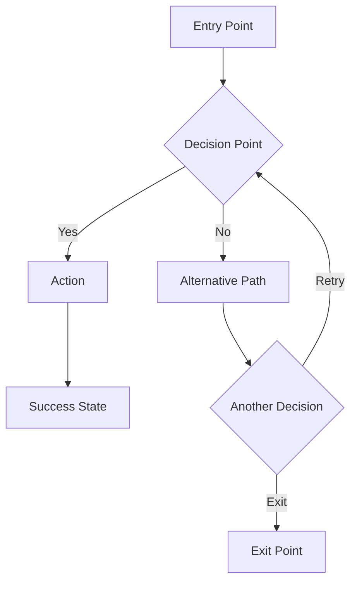
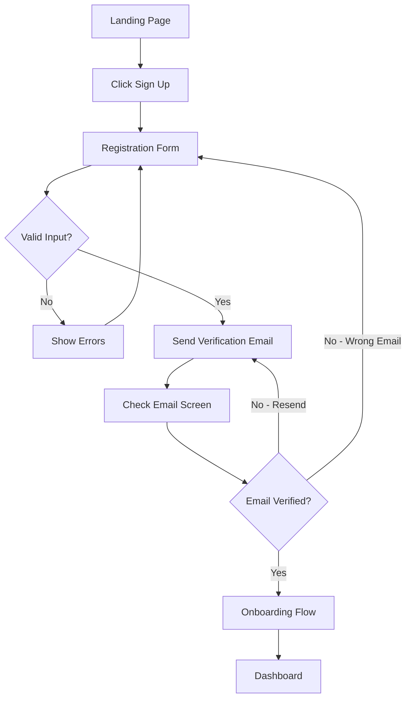
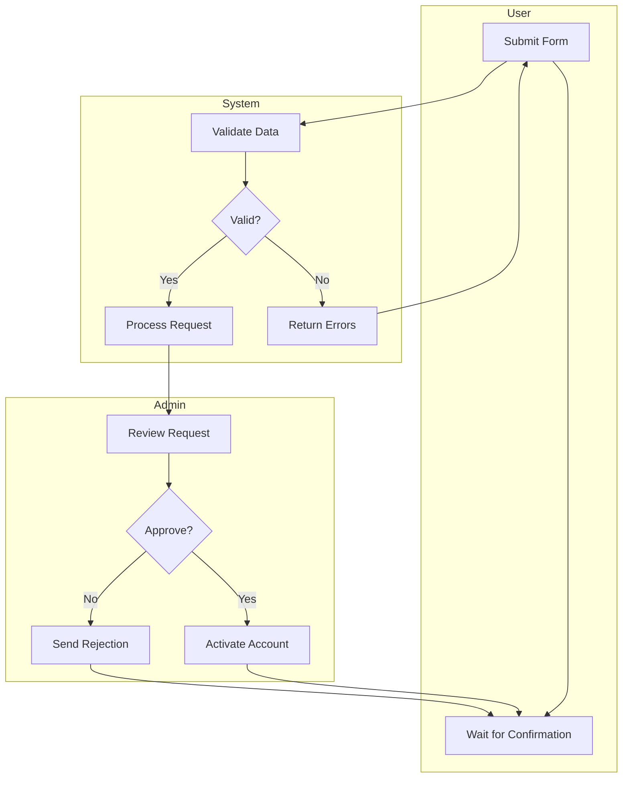

# Definition Templates

## User Flow Diagrams (Mermaid)

Use Mermaid flowcharts for user flows. They render natively in GitHub, Obsidian, Notion, and most documentation tools.

### Basic Flow Pattern



### Authentication Flow Example



### Flow Diagram Conventions
- **Rectangles** `[text]` — screens or pages
- **Diamonds** `{text}` — decision points
- **Rounded** `(text)` — processes or actions
- **Stadium** `([text])` — start/end points
- Always include error paths and edge cases
- Label every arrow with the condition or action
- Keep flows under 20 nodes — split complex flows into sub-flows

### Multi-Actor Flow (Swimlanes)

For flows involving multiple users or systems, use subgraphs:



## Journey Map Format

```markdown
## Journey Map: [Journey Name]

**Persona:** [Which persona is this for]
**Scenario:** [One-sentence description of what they're trying to do]

| Stage | Actions | Thinking | Feeling | Pain Points | Opportunities |
|-------|---------|----------|---------|-------------|---------------|
| Awareness | [What they do] | [What they're thinking] | 😊/😐/😟 | [Friction] | [How we can help] |
| Consideration | | | | | |
| Decision | | | | | |
| Onboarding | | | | | |
| First Use | | | | | |
| Ongoing Use | | | | | |
| Advocacy/Churn | | | | | |
```

### Journey Map Tips
- Use the emotional curve to find the critical moments — big dips are design opportunities
- Stages should reflect YOUR product's lifecycle, not a generic template
- "Thinking" column reveals information needs — these become content requirements
- "Pain Points" column drives your feature priorities

## Feature Prioritization

### MoSCoW Method

Categorize features into four buckets:

```markdown
## Feature Prioritization: [Product/Release]

### Must Have (non-negotiable for launch)
- [ ] [Feature] — [Why it's essential]
- [ ] [Feature] — [Why it's essential]

### Should Have (important but not blocking)
- [ ] [Feature] — [Impact if deferred]
- [ ] [Feature] — [Impact if deferred]

### Could Have (nice-to-have, if time permits)
- [ ] [Feature] — [User value]
- [ ] [Feature] — [User value]

### Won't Have (explicitly out of scope for now)
- [ ] [Feature] — [Why it's deferred, when to revisit]
- [ ] [Feature] — [Why it's deferred, when to revisit]
```

### RICE Scoring

For more rigorous prioritization, score each feature:

| Feature | Reach (users/quarter) | Impact (1-3) | Confidence (%) | Effort (person-weeks) | RICE Score |
|---------|----------------------|--------------|----------------|----------------------|------------|
| [Name]  | [number]             | [1-3]        | [50-100%]      | [number]             | [R×I×C÷E]  |

**Impact scale:** 3 = massive, 2 = high, 1 = medium, 0.5 = low, 0.25 = minimal

Sort by RICE score descending. The top items are your roadmap.
