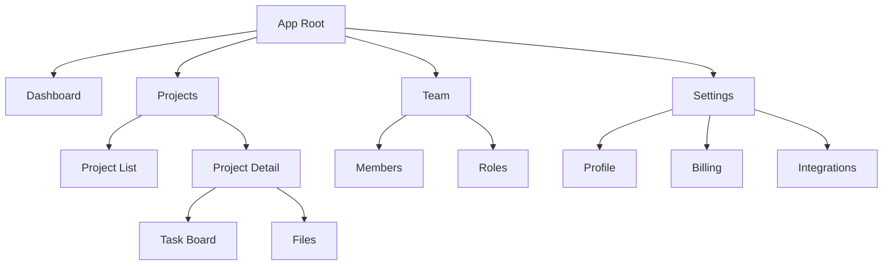

# Information Architecture Patterns

## Site Map / Screen Inventory

List every screen the product needs, organized by section.

```markdown
## Screen Inventory: [Product Name]

### Primary Navigation
1. **Dashboard** — Overview of key metrics and recent activity
2. **[Section]** — [Purpose]
   - 2.1 [Sub-page] — [Purpose]
   - 2.2 [Sub-page] — [Purpose]
3. **[Section]** — [Purpose]
4. **Settings** — Account and app configuration
   - 4.1 Profile
   - 4.2 Billing
   - 4.3 Notifications
   - 4.4 Integrations

### Secondary / Contextual Screens
- **Onboarding** — First-time setup wizard
- **Empty states** — What each section looks like with no data
- **Error pages** — 404, 500, permission denied
- **Modals/Overlays** — Confirmation dialogs, quick-create forms

### Auth Screens
- Sign up
- Log in
- Forgot password
- Email verification
```

### Site Map as Mermaid



## Navigation Patterns

Choose the right navigation model for your product's complexity.

### Top Navigation Bar
**Best for:** Marketing sites, simple apps with 3-7 top-level sections
**Pattern:** Horizontal bar with links, logo left, actions right

### Sidebar Navigation
**Best for:** Complex apps, dashboards, tools with many sections
**Pattern:** Vertical sidebar with icons + labels, collapsible to icons-only
**Considerations:**
- Group related items with section headers
- Show active state clearly
- Consider collapsed/expanded states for responsive design
- Bottom of sidebar: user menu, settings, help

### Tab Navigation
**Best for:** Related content views within a section, mobile apps
**Pattern:** Horizontal tabs, usually 3-5 items
**Rule:** All tabs should be peers — don't mix content types

### Breadcrumb Navigation
**Best for:** Deep hierarchies (e-commerce categories, documentation, file systems)
**Pattern:** Home > Category > Sub-category > Item
**Combine with:** Sidebar or top nav for primary navigation

### Command Palette
**Best for:** Power user tools, developer products
**Pattern:** Cmd+K overlay with search and actions
**Combine with:** Any other nav pattern as a power-user shortcut

### Choosing a Pattern

| Product Type | Recommended Navigation | Why |
|-------------|----------------------|-----|
| Marketing site | Top nav | Few pages, scannability matters |
| SaaS dashboard | Sidebar + breadcrumbs | Many sections, deep hierarchy |
| Mobile app | Bottom tabs + stack nav | Thumb accessibility, limited space |
| Documentation | Sidebar + breadcrumbs + search | Deep hierarchy, findability critical |
| E-commerce | Top nav + mega menu + breadcrumbs | Many categories, browsing + search |
| Internal tool | Sidebar + command palette | Efficiency, power users |

## Content Hierarchy

For each key screen, define the content hierarchy — what information appears, in what order, with what visual weight.

```markdown
## Content Hierarchy: [Screen Name]

### Primary (immediate attention)
- [Element] — [Why it's primary]
- [Element] — [Why it's primary]

### Secondary (supports primary, visible on scan)
- [Element]
- [Element]

### Tertiary (available but not competing for attention)
- [Element]
- [Element]

### Actions
- **Primary action:** [Button/CTA] — [What it does]
- **Secondary actions:** [Less prominent actions]
- **Destructive actions:** [Delete, cancel — visually de-emphasized, confirmation required]
```

## State Mapping

Every screen has multiple states. Document them to prevent implementation surprises.

```markdown
## State Map: [Screen/Component Name]

| State | Trigger | What the user sees | Data shown |
|-------|---------|-------------------|------------|
| Empty | No data exists yet | Empty state illustration + CTA to create first item | None |
| Loading | Data is being fetched | Skeleton loaders matching content layout | Placeholder shapes |
| Populated | Data exists | Full content with all interactive elements | [List data fields] |
| Error | API failure or timeout | Error message + retry button | Cached data if available |
| Partial | Some data loaded, some failed | Mixed content + inline error indicators | Available data only |
| Offline | No network connection | Banner notification + cached content | Last synced data |
| Permission denied | User lacks access | Explanation + request access CTA | None |
```

### States most teams forget
- **Empty state** — The first thing every new user sees. Make it helpful, not sad.
- **Partial failure** — What happens when half the API calls fail?
- **Stale data** — How do you indicate data might be outdated?
- **Bulk/overflow** — What happens with 10,000 items? Pagination? Virtual scroll?
- **Concurrent editing** — Two users editing the same thing simultaneously
